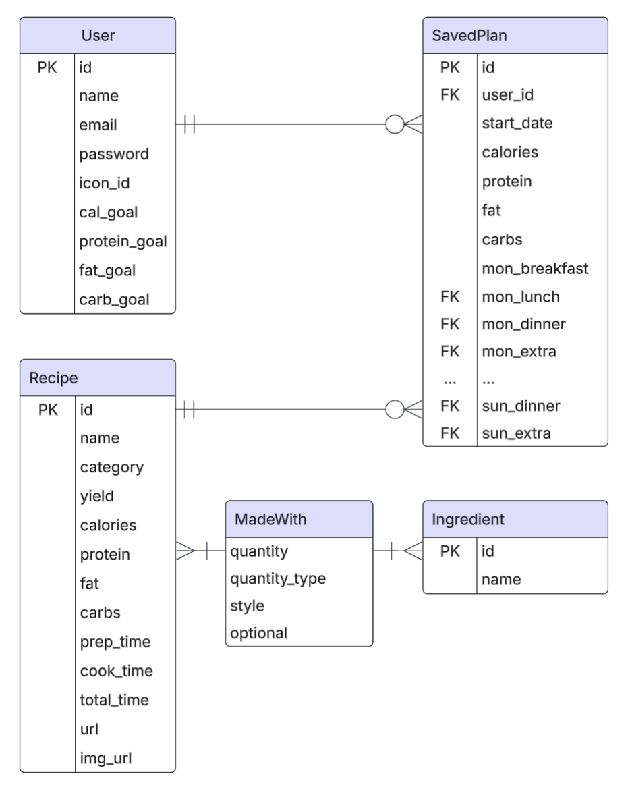
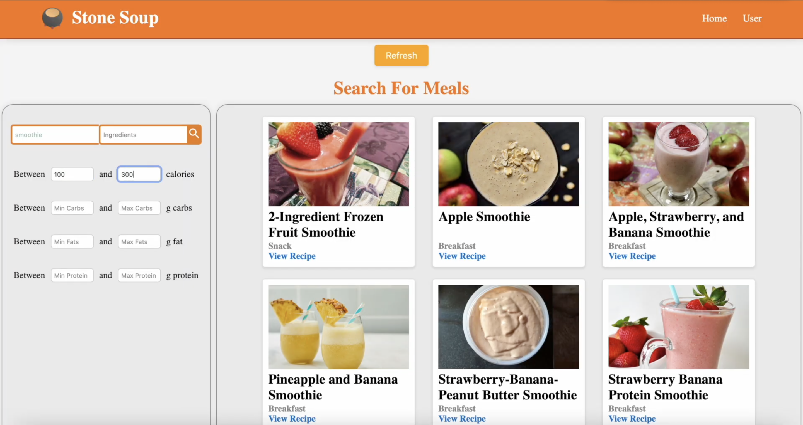
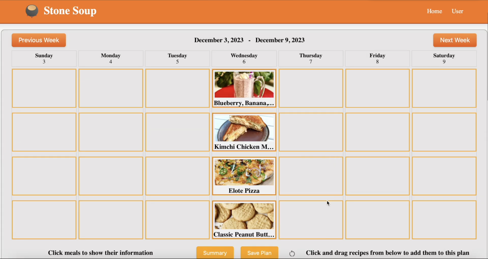
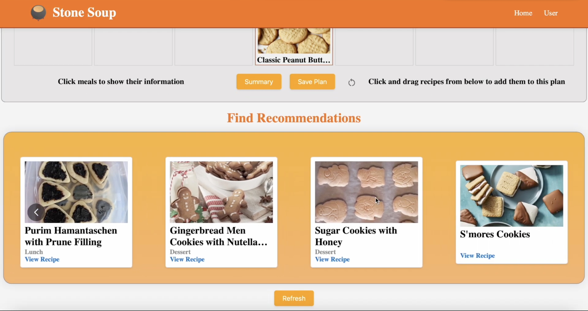

<h1> Stone Soup</h1>

> Final Project for Database Concepts - CSE 30246

**Stone Soup** is an intelligent meal planning application that lets you search a database of 14,000 recipes, create weekly meal plans, track your macros, and receive personalized recipe recommendations based on ingredients already on your shopping list.

## Table of Contents
- [Project Status](#project-status)
- [Local Development](#local-development)
- [Database Schema](#database-schema)
- [Gallery](#gallery)
- [Group Members](#group-members)

## Project Status
In class, we developed a web scraper and compiled a database of 14,000 recipes for use in the Stone Soup app. However, this MySQL database existed on a university machine and was deleted at the end of the semester.

While the instructions below explain how to run the project locally, please note that without the original database, much of the core functionality is unavailable. 

Please see the Gallery section instead.

## Local Development

### Frontend
```bash
# Install dependencies
npm i

# Create build for Flask to serve
npm run build
```

### Backend
```bash
# Install system dependencies
brew install pkg-config mysql

# Install required packages
pip install -r requirements.txt

# Run flask server
python3 backend/app.py
```

## Database Schema


## Gallery



**Figure 1.** Search for recipes and filter by macros.



**Figure 2.** Drag and drop recipes to the Calendar section to meal plan by week.



**Figure 3.** Receive personalized recommendations based on your current grocery list.


**Figure 4.** On the profile page, see your macro history and set goals.

## Group Members
- Nolan Kyhl
- Jonny D'Alonzo
- Nick Palma
